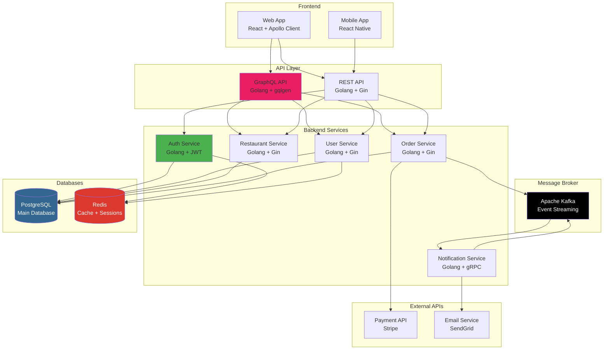

# delicious-and-kidney

https://github.com/golang-standards/project-layout
https://www.youtube.com/watch?v=B0lV7I3FO4E

```mermaid
graph TB
    subgraph "Frontend"
        WEB[Web App<br/>React + Apollo Client]
        MOB[Mobile App<br/>React Native]
    end
    
    subgraph "API Layer"
        GRAPHQL[GraphQL API<br/>Golang + gqlgen]
        REST[REST API<br/>Golang + Gin]
    end
    
    subgraph "Backend Services"
        AUTH[Auth Service<br/>Golang + JWT]
        USER[User Service<br/>Golang + Gin]
        RESTAURANT[Restaurant Service<br/>Golang + Gin]
        ORDER[Order Service<br/>Golang + Gin]
        NOTIFICATION[Notification Service<br/>Golang + gRPC]
    end
    
    subgraph "Message Broker"
        KAFKA[Apache Kafka<br/>Event Streaming]
    end
    
    subgraph "Databases"
        POSTGRES[(PostgreSQL<br/>Main Database)]
        REDIS[(Redis<br/>Cache + Sessions)]
    end
    
    subgraph "External APIs"
        PAYMENT[Payment API<br/>Stripe]
        EMAIL[Email Service<br/>SendGrid]
    end
    
    %% Frontend connections
    WEB --> GRAPHQL
    WEB --> REST
    MOB --> REST
    
    %% API connections
    GRAPHQL --> USER
    GRAPHQL --> RESTAURANT
    GRAPHQL --> ORDER
    REST --> AUTH
    REST --> USER
    REST --> RESTAURANT
    REST --> ORDER
    
    %% Service connections
    AUTH --> POSTGRES
    AUTH --> REDIS
    USER --> POSTGRES
    USER --> REDIS
    RESTAURANT --> POSTGRES
    ORDER --> POSTGRES
    ORDER --> KAFKA
    NOTIFICATION --> KAFKA
    
    %% External integrations
    ORDER --> PAYMENT
    NOTIFICATION --> EMAIL
    
    %% Kafka events
    KAFKA --> NOTIFICATION
    
    style GRAPHQL fill:#e91e63
    style KAFKA fill:#000000,color:#ffffff
    style REDIS fill:#dc382d,color:#ffffff
    style POSTGRES fill:#336791,color:#ffffff
    style AUTH fill:#4caf50
```