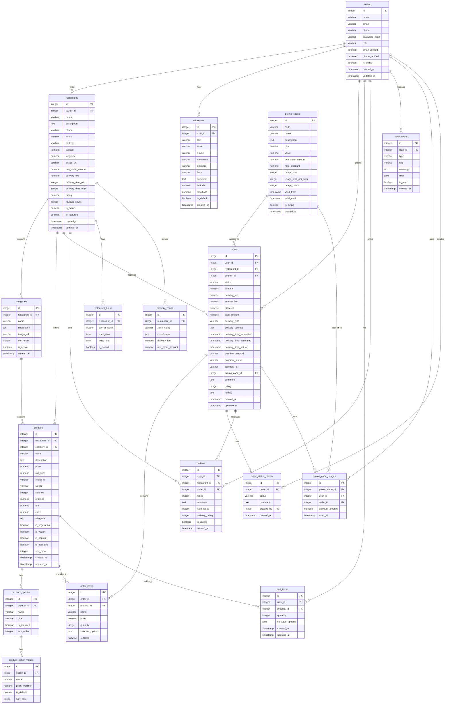

```mermaid
erDiagram
    users {
        integer id PK
        varchar name
        varchar email
        varchar phone
        varchar password_hash
        varchar role
        boolean email_verified
        boolean phone_verified
        boolean is_active
        timestamp created_at
        timestamp updated_at
    }

    restaurants {
        integer id PK
        integer owner_id FK
        varchar name
        text description
        varchar phone
        varchar email
        varchar address
        numeric latitude
        numeric longitude
        varchar image_url
        numeric min_order_amount
        numeric delivery_fee
        integer delivery_time_min
        integer delivery_time_max
        numeric rating
        integer reviews_count
        boolean is_active
        boolean is_featured
        timestamp created_at
        timestamp updated_at
    }

    categories {
        integer id PK
        integer restaurant_id FK
        varchar name
        text description
        varchar image_url
        integer sort_order
        boolean is_active
        timestamp created_at
    }

    products {
        integer id PK
        integer restaurant_id FK
        integer category_id FK
        varchar name
        text description
        numeric price
        numeric old_price
        varchar image_url
        varchar weight
        integer calories
        numeric proteins
        numeric fats
        numeric carbs
        text allergens
        boolean is_vegetarian
        boolean is_vegan
        boolean is_popular
        boolean is_available
        integer sort_order
        timestamp created_at
        timestamp updated_at
    }

    product_options {
        integer id PK
        integer product_id FK
        varchar name
        varchar type
        boolean is_required
        integer sort_order
    }

    product_option_values {
        integer id PK
        integer option_id FK
        varchar name
        numeric price_modifier
        boolean is_default
        integer sort_order
    }

    addresses {
        integer id PK
        integer user_id FK
        varchar title
        varchar street
        varchar house
        varchar apartment
        varchar entrance
        varchar floor
        text comment
        numeric latitude
        numeric longitude
        boolean is_default
        timestamp created_at
    }

    orders {
        integer id PK
        integer user_id FK
        integer restaurant_id FK
        integer courier_id FK
        varchar status
        numeric subtotal
        numeric delivery_fee
        numeric service_fee
        numeric discount
        numeric total_amount
        varchar delivery_type
        json delivery_address
        timestamp delivery_time_requested
        timestamp delivery_time_estimated
        timestamp delivery_time_actual
        varchar payment_method
        varchar payment_status
        varchar payment_id
        integer promo_code_id FK
        text comment
        integer rating
        text review
        timestamp created_at
        timestamp updated_at
    }

    order_items {
        integer id PK
        integer order_id FK
        integer product_id FK
        varchar name
        numeric price
        integer quantity
        json selected_options
        numeric subtotal
    }

    order_status_history {
        integer id PK
        integer order_id FK
        varchar status
        text comment
        integer created_by FK
        timestamp created_at
    }

    cart_items {
        integer id PK
        integer user_id FK
        integer product_id FK
        integer quantity
        json selected_options
        timestamp created_at
        timestamp updated_at
    }

    promo_codes {
        integer id PK
        varchar code
        varchar name
        text description
        varchar type
        numeric value
        numeric min_order_amount
        numeric max_discount
        integer usage_limit
        integer usage_limit_per_user
        integer usage_count
        timestamp valid_from
        timestamp valid_until
        boolean is_active
        timestamp created_at
    }

    promo_code_usages {
        integer id PK
        integer promo_code_id FK
        integer user_id FK
        integer order_id FK
        numeric discount_amount
        timestamp used_at
    }

    reviews {
        integer id PK
        integer user_id FK
        integer restaurant_id FK
        integer order_id FK
        integer rating
        text comment
        integer food_rating
        integer delivery_rating
        boolean is_visible
        timestamp created_at
    }

    notifications {
        integer id PK
        integer user_id FK
        varchar type
        varchar title
        text message
        json data
        boolean is_read
        timestamp created_at
    }

    restaurant_hours {
        integer id PK
        integer restaurant_id FK
        integer day_of_week
        time open_time
        time close_time
        boolean is_closed
    }

    delivery_zones {
        integer id PK
        integer restaurant_id FK
        varchar zone_name
        json coordinates
        numeric delivery_fee
        numeric min_order_amount
    }

    %% Relationships
    users ||--o{ restaurants : owns
    users ||--o{ addresses : has
    users ||--o{ orders : places
    users ||--o{ cart_items : has
    users ||--o{ reviews : writes
    users ||--o{ notifications : receives
    users ||--o{ promo_code_usages : uses
    users ||--o{ order_status_history : creates

    restaurants ||--o{ categories : contains
    restaurants ||--o{ products : offers
    restaurants ||--o{ orders : receives
    restaurants ||--o{ reviews : gets
    restaurants ||--o{ restaurant_hours : has
    restaurants ||--o{ delivery_zones : serves

    categories ||--o{ products : contains

    products ||--o{ product_options : has
    products ||--o{ order_items : included_in
    products ||--o{ cart_items : added_to

    product_options ||--o{ product_option_values : has

    orders ||--o{ order_items : contains
    orders ||--o{ order_status_history : has
    orders ||--o{ reviews : generates
    orders ||--o{ promo_code_usages : uses

    promo_codes ||--o{ orders : applied_to
    promo_codes ||--o{ promo_code_usages : tracked_in
```